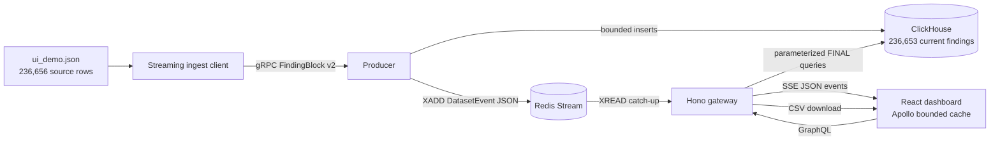

# Security Vulnerability Dashboard

An Nx/Bun playground for exploring a large vulnerability dataset through
ClickHouse-authoritative queries. The browser loads bounded GraphQL cursor
pages and aggregates; server-side ingestion uses gRPC/protobuf; Redis Streams
and JSON SSE carry only live changes and invalidation.

## Architecture



- `apps/producer` accepts bounded `FindingBlock`s through the v2
  `IngestService`, writes ClickHouse, and publishes validated Dataset Events.
- `apps/gateway` serves bounded GraphQL, identity-encoded SSE at
  `/api/stream`, and local CSV downloads at `/api/exports/:id`.
- `apps/dashboard` uses Apollo Client for bounded pages, facets, aggregates,
  detail, and export status. Zustand contains live operational state only.
- `packages/shared` holds finding, filter, time-range, and Dataset Event
  contracts. `packages/proto` is server-only.

The source contains **236,656 Source Records**. The current Finding identity is
`(group, repo, image, cve, packageName, packageVersion, path)`. Three duplicate
identity tuples collapse under ClickHouse `FINAL`, producing **236,653 current
Findings** after a full ingest.

## Prerequisites

- Bun 1.3 or compatible
- Docker with Compose
- The supplied `ui_demo.json` corpus, kept outside version control

On WSL, enable Docker Desktop integration for the current distribution.

## Clean-clone setup

Install dependencies and create local configuration:

```bash
bun install
cp .env.example .env
```

Place the supplied source file at:

```text
apps/producer/data/raw/ui_demo.json
```

That directory is gitignored. Do not commit or copy source data into
documentation, fixtures, or browser assets.

Start the application stack:

```bash
bun dev
```

`bun dev` runs the infrastructure `up` target and then serves:

- producer gRPC: `127.0.0.1:50051`
- gateway HTTP: `http://127.0.0.1:4000`
- dashboard: `http://127.0.0.1:4200`

With `bun dev` still running, ingest from a second terminal:

```bash
bunx nx run producer:ingest --force
```

`--force` asks the producer to truncate current local rows before streaming the
source. The ingest command validates both counts: 236,656 source rows written
and 236,653 current Findings under `FINAL`.

Infrastructure can also be managed directly:

```bash
docker compose -f docker/compose.yml up -d
docker compose -f docker/compose.yml down
```

The root `bun run infra:up`, `bun run infra:smoke`, and `bun run infra:down`
scripts map to the Nx infrastructure targets. `infra:down` removes local
volumes.

## Local runtime flows

### Bounded GraphQL

The gateway exposes `POST /graphql`. This example reads one cursor page:

```bash
curl http://127.0.0.1:4000/graphql \
  -H 'content-type: application/json' \
  --data '{"query":"query { findings(first: 2) { totalCount pageInfo { endCursor hasNextPage } edges { node { id cve severity packageName packageVersion } } } }"}'
```

Available operations include:

- `findings`: bounded keyset-cursor connection
- `facets`, `searchSuggestions`, and `vulnerabilityOverview`
- `finding(id)` and `datasetInfo`
- `createExport(input)` and `exportJob(id)`

ClickHouse performs filter, search, sort, facet, aggregate, pagination, detail
selection, and export selection. Bounded result queries use
`JSONCompactEachRow`.

### Dataset Event SSE

Observe new live events:

```bash
curl -N http://127.0.0.1:4000/api/stream
```

The stream sends versioned JSON Dataset Events, Redis entry ids, and
keepalives. It does not replay the historical corpus. A client can reconnect
from a retained entry:

```bash
curl -N http://127.0.0.1:4000/api/stream \
  -H 'Last-Event-ID: 1720000000000-0'
```

For local live activity, set a non-zero interval in `.env` before starting
`bun dev`:

```text
PRODUCER_SIMULATE_CHANGES_INTERVAL_MS=5000
```

The simulator is off by default and writes real local row versions. Live mode
applies/refetches changes; a windowed time range increments the pending-update
counter until Refresh is selected.

### Server-side export

Explore's Export CSV button creates an asynchronous GraphQL job, polls job
status, and downloads `/api/exports/:id` when ready. The gateway streams
spreadsheet-safe `CSVWithNames` output from ClickHouse to `.data/exports` by
default. Redis stores expiring metadata.

Export files are local to one gateway process. This playground does not provide
shared multi-replica artifact storage or a production export service.

## Configuration

Copy `.env.example` and adjust local values. Important groups are:

- ClickHouse: `CLICKHOUSE_URL`, `CLICKHOUSE_DB`, `CLICKHOUSE_USER`,
  `CLICKHOUSE_PASSWORD`
- Redis/events: `REDIS_URL`, `DATASET_VERSION`, `DATASET_EVENTS_STREAM`,
  retention and coalescing limits
- producer/ingest: host, port, source path, block/change limits, simulator
- gateway: host, port, `GRAPHQL_MAX_FIRST`
- export: `EXPORT_DIR`, metadata TTL, and the reserved sync-row policy value

Server credentials must never use `VITE_*`; Vite-prefixed values are public.

## Validation commands

These are available commands, not claims about a particular checkout:

```bash
bunx nx run-many -t typecheck
bunx biome check .
bunx nx build dashboard
bunx nx run dashboard:codegen
bunx nx run proto:buf-lint
bunx nx run proto:buf-generate
git diff --check
```

T32 owns focused Jest/React Testing Library coverage, Playwright browser flows,
and runtime reconciliation. No blanket coverage threshold is used.

## Documentation

- [AGENTS.md](AGENTS.md): operating model and prompt defense
- [docs/RULES.md](docs/RULES.md): hard constraints
- [docs/CONTEXT.md](docs/CONTEXT.md): settled vocabulary and identity
- [docs/TECH_STACK.md](docs/TECH_STACK.md): observed technologies
- [docs/STRUCTURE.md](docs/STRUCTURE.md): current source map
- [ADR-0001](docs/adr/0001-clickhouse-authoritative-query-engine.md):
  authoritative query decision
- [ADR-0002](docs/adr/0002-binary-live-transport-deferred.md): proposed
  binary live option
- [docs/tickets/](docs/tickets/): history, status, and T32 handoff

## Release and license

This repository has no production deployment or release pipeline. Local
Compose and Nx serve targets are the supported runtime shape.

Proprietary. Do not redistribute source or dataset content.
