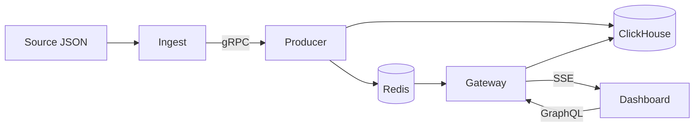

# Security Vulnerability Dashboard

## What

A local playground that lets you explore a large vulnerability dataset in a
React dashboard.

- **ClickHouse** answers search, filters, sorts, and pages
- **GraphQL** returns small, bounded results to the browser
- **gRPC** ingests source data into ClickHouse
- **Redis + SSE** push live change events only

## Why

Browsers cannot hold hundreds of thousands of rows. ClickHouse owns the data;
the UI only keeps the current page and live status.

## Architecture



## Setup

**Need:** Bun and Docker Compose. A checked-in ~10MB sample is the default
ingest source (`apps/producer/data/sample/ui_demo.sample.json`).

```bash
bun install
cp .env.example .env
```

```bash
# Terminal 1 — starts ClickHouse, Redis, producer, gateway, dashboard
bun dev

# Terminal 2 — load the sample (truncates local rows first)
bunx nx run producer:ingest --force
```

Then open **http://127.0.0.1:4200**.

Optional full corpus (~372MB): place `ui_demo.json` at
`apps/producer/data/raw/ui_demo.json` (gitignored), set
`INGEST_SOURCE=apps/producer/data/raw/ui_demo.json` in `.env`, then re-ingest.
Regenerate the sample from the full file with `bunx nx run producer:make-sample`.

| Service   | URL / port              |
|-----------|-------------------------|
| Dashboard | http://127.0.0.1:4200   |
| Gateway   | http://127.0.0.1:4000   |
| Producer  | `127.0.0.1:50051`       |

Optional live changes: set `PRODUCER_SIMULATE_CHANGES_INTERVAL_MS=5000` in
`.env`, then restart `bun dev`.

Stop infra and wipe volumes: `bun run infra:down`.

## Further reading

| Doc | For |
|-----|-----|
| [AGENTS.md](AGENTS.md) | How agents / contributors work here |
| [docs/RULES.md](docs/RULES.md) | Hard constraints |
| [docs/CONTEXT.md](docs/CONTEXT.md) | Domain vocabulary |
| [docs/TECH_STACK.md](docs/TECH_STACK.md) | Technologies and roles |
| [docs/STRUCTURE.md](docs/STRUCTURE.md) | Repo map |
| [ADR-0001](docs/adr/0001-clickhouse-authoritative-query-engine.md) | Why ClickHouse owns queries |
| [docs/tickets/](docs/tickets/) | Delivery history and T32 QA |

Proprietary. Do not redistribute source or dataset content.
