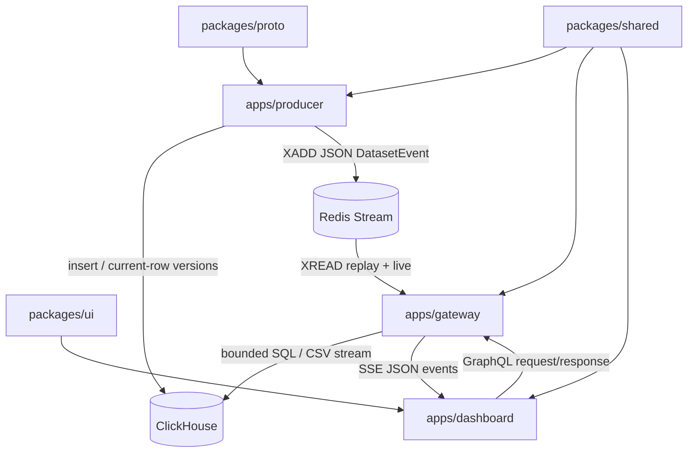

# Repository structure

Observed map after T30. Generated build output, dependencies, and TypeScript
build metadata are omitted.

## Top level

```text
.
├── apps/
│   ├── dashboard/        React/Vite browser application
│   ├── gateway/          Hono GraphQL, SSE, and export HTTP boundary
│   └── producer/         gRPC ingestion and Dataset Event publisher
├── packages/
│   ├── proto/            server-only protobuf v2 contract and helpers
│   ├── shared/           isomorphic query/event/domain contracts
│   └── ui/               shadcn-style primitives and Tailwind theme
├── tools/infra/          local Compose lifecycle and smoke tooling
├── docker/               ClickHouse and Redis local services
├── e2e/                  Playwright suite location; specs arrive in T32
├── scripts/              workspace dev and e2e launchers
├── docs/                 canonical docs, ADRs, and tickets
└── .cursor/              repository agents, skills, and rules
```

Root `package.json` exposes Bun/Nx entry points. `nx.json`, `tsconfig*.json`,
and `biome.json` define orchestration, strict project references, and supported
format/lint inputs. `.env.example` is the local server configuration template.

## Application boundaries

### `apps/producer`

```text
apps/producer/
├── scripts/
│   ├── ingest.ts         bounded source parser and gRPC ingest client
│   ├── census.ts         bounded source census
│   ├── empty-groups.ts   bounded source inspection helper
│   └── smoke.ts          v2 IngestService smoke client
└── src/
    ├── server.ts                    HTTP/2 Connect service composition
    ├── ingest-service.ts            IngestBlocks and ApplyChanges handlers
    ├── clickhouse-writer.ts         bounded row inserts and current counts
    ├── event-publisher.ts           validated Redis Stream XADD
    ├── simulator.ts                 opt-in development changes
    ├── block.ts                     FindingBlock conversion
    ├── finding-row.ts               source normalization
    ├── env.ts                       validated producer configuration
    └── *.types.ts                   colocated implementation contracts
```

The ingest script streams the default sample at
`apps/producer/data/sample/ui_demo.sample.json` (or the optional full corpus at
`apps/producer/data/raw/ui_demo.json`, which is gitignored) into bounded
protobuf v2 blocks. The producer writes ClickHouse and publishes JSON Dataset
Events. It does not serve historical findings to the browser.

### `apps/gateway`

```text
apps/gateway/src/
├── server.ts                         Hono/Apollo route composition
├── env.ts                            validated gateway configuration
├── sse.ts                            identity-encoded SSE route
├── sse-redis-stream.ts               XREAD, replay, and stream-id validation
├── sse-coalescing.ts                 burst invalidation policy
├── sentry.ts
└── graphql/
    ├── schema.graphql                bounded public schema
    ├── context.ts                    ClickHouse and Redis clients
    ├── input.ts                      GraphQL input validation and clamping
    ├── cursor.ts                     opaque keyset cursor codec
    ├── query-compiler.ts             parameterized filters/order/keysets
    ├── clickhouse.ts                 JSONCompactEachRow execution boundary
    ├── findings-query.ts             connection, detail, suggestions
    ├── facets-query.ts
    ├── overview-query.ts
    ├── overview-query-statements.ts
    ├── dataset-query.ts
    ├── finding-fields.ts
    ├── resolvers/                    operation-specific resolvers
    └── export/
        ├── export-query.ts            CSVWithNames query compilation
        ├── export-worker.ts           asynchronous local job queue
        ├── job-store.ts               expiring Redis metadata
        ├── artifact.ts                confined local-disk paths
        ├── download-route.ts          streamed CSV response
        └── export.types.ts
```

The gateway talks directly to ClickHouse for every query. It does not call the
producer for browser reads and does not import `packages/proto`.

### `apps/dashboard`

```text
apps/dashboard/
├── codegen.ts
├── vite.config.ts
└── src/
    ├── app/                  providers, shell, route loaders, URL state
    ├── routes/               lazy overview, explore, finding, compare routes
    ├── graphql/
    │   ├── operations.graphql
    │   ├── operations.ts
    │   ├── variables.ts
    │   ├── cache.ts          bounded connection merge policy
    │   └── __generated__/    GraphQL Code Generator output
    ├── state/
    │   └── dashboard-store.ts  live operational state only
    └── features/
        ├── dataset/          datasetInfo hook
        ├── live/             app-wide EventSource integration
        ├── time-range/       dashboard TimeRange binding
        ├── explore/          filters, toolbar, cursor pages, grid, export
        ├── overview/         aggregate hooks and chart/card groups
        ├── detail/           finding query hook
        └── finding-detail/   source-preserving detail presentation
```

There is no dashboard query worker, producer client, browser protobuf
dependency, or hand-maintained legacy GraphQL type file.

## Packages

### `packages/shared/src`

- `finding-fields.ts` and `finding-fields.types.ts`: field registry, row/detail
  shapes, query allowlists.
- `finding-filters.ts`: filters, sorts, finding ids, and pagination cursors.
- `time-range.ts`: Live, rolling, and custom `publishedAt` ranges.
- `analysis-mode.ts`: exact `kaiStatus` exclusions.
- `dataset-events.ts` and `dataset-event-codec.ts`: versioned JSON live
  contract and isolated codec.
- `clickhouse-datetime.ts`: explicit ClickHouse-to-wire date conversion.

This package has only `zod` as a runtime dependency and remains browser-safe.

### `packages/proto`

- `proto/findings/v2/findings.proto`: `FindingBlock`, `IngestBlocks`, and
  `ApplyChanges`.
- `src/gen/findings/v2/findings_pb.ts`: generated protobuf TypeScript.
- `src/dict.ts`, `src/offsets.ts`: bounded column helpers.
- `scripts/smoke.ts`: v2 transport smoke.

Only the producer and server-side ingest tooling consume this package.

### `packages/ui/src`

- `components/ui/`: button, input, label, select, table, card, badge,
  skeleton, popover, tooltip, toggle, toggle group, and calendar primitives.
- `components/time-range/`: generic compound TimeRange control.
- `styles/globals.css`: shared Tailwind/CSS-variable theme.

The UI package has no dashboard domain, routing, GraphQL, or server imports.

## Infrastructure

- `docker/compose.yml` pins ClickHouse 24.12.2.29 and Redis 7.4.2, with health
  checks, memory bounds, ports, and named volumes.
- `docker/clickhouse/init/01_findings.sql` defines the identity-aware
  `ReplacingMergeTree`, materialized dates/id, indexes, and projections.
- `docker/clickhouse/config.d/` contains local listen and memory settings.
- `tools/infra/scripts/` owns `up`, health wait, teardown, and a local
  ClickHouse/Redis smoke check.

## Dependency and runtime flow



Nx project files classify apps and packages with tags, but the current
configuration does not declare an `enforce-module-boundaries` rule. The
direction remains a repository contract checked in review: applications may
import packages; packages must not import applications. Additional boundaries
are architectural: the dashboard must not import `packages/proto`, and the
gateway must not route browser reads through the producer.

## Generated and local-only material

- GraphQL generated output: `apps/dashboard/src/graphql/__generated__/`,
  regenerated with `bunx nx run dashboard:codegen`.
- Buf generated output: `packages/proto/src/gen/findings/v2/`, regenerated
  with `bunx nx run proto:buf-generate`.
- Local source data: checked-in sample under `apps/producer/data/sample/`;
  optional full corpus under `apps/producer/data/raw/` (untracked; never read
  wholesale by agents or tests).
- Local export artifacts: `.data/exports/` by default; single-node and
  disposable.
- Build outputs, dependency directories, Nx caches, and TypeScript build
  metadata are not source boundaries.
