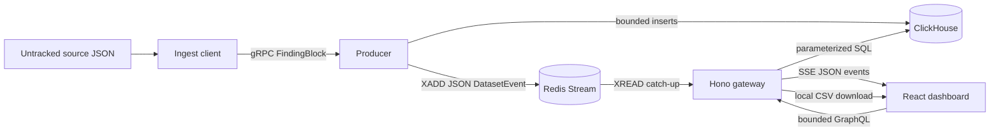

# Tech Stack

Observed technologies and responsibilities after T30. Dependency versions are
the ranges declared by the workspace manifests; installed tooling versions are
not release guarantees.

## Dashboard

- **React 19** and **React DOM 19** render the Vite SPA.
- **Vite 7.1** builds and serves `apps/dashboard`; the dev server proxies
  `/graphql` and `/api/stream` to the gateway.
- **React Router 8.3** owns lazy routes and validated, shareable URL state.
- **Apollo Client 4.2** owns bounded GraphQL pages, facets, aggregates,
  dataset metadata, export status, and normalized detail/row entities. Its
  findings cache retains one argument partition capped at 600 edges.
- **Zustand 5.0** owns live operational state only: connection state, last
  observed event id, pending updates, and a bounded recent-event list.
- **TanStack Table 8** supplies headless column and manual server-sort state.
  **TanStack Virtual 3.14** renders the visible subset of loaded cursor pages.
- **Recharts 3.10** renders overview charts through dashboard components.
- **shadcn-style local primitives**, **Radix UI**, and **Tailwind CSS 4.1**
  provide the shared design system in `packages/ui`.
- **react-day-picker 10.0** backs the generic calendar range control.
- **zod 4.5** through `zod/mini` validates browser and shared boundaries.

The browser does not run a second query engine. It has no protobuf runtime,
full-corpus index, DuckDB, Parquet, or R2 data path.

## Gateway

- **Hono 4.13** and **`@hono/node-server` 2.1** expose health, GraphQL, SSE,
  and export-download routes.
- **Apollo Server 5.5** executes the GraphQL schema at `POST /graphql`.
  Request bodies, operation inputs, cursors, and output bounds are validated.
- **`@clickhouse/client` 1.23** talks directly to ClickHouse. Bounded query
  modules use parameterized SQL and `JSONCompactEachRow`; exports stream
  `CSVWithNames` without buffering the complete result in Node.
- **ioredis 6.0** reads the Dataset Event stream, stores export metadata, and
  resumes incomplete export jobs.
- Hono compression applies to GraphQL. SSE is deliberately identity-encoded
  because the shipped compression middleware cannot guarantee per-event
  flushing.

## Producer and server-side ingestion

- **Connect-ES / Connect Node 2.1** serves the v2 protobuf `IngestService`
  over Node HTTP/2 semantics from the Bun process.
- **Buf CLI 1.72**, **protoc-gen-es / protobuf runtime 2.14**, and the
  committed v2 generated TypeScript define bounded columnar `FindingBlock`
  ingestion plus `ApplyChanges`.
- **`@clickhouse/client` 1.23** writes bounded batches and current row versions.
- **ioredis 6.0** publishes validated JSON `DatasetEvent`s with `XADD`.
- **stream-json 3.6** and **stream-chain 4.2** flatten the untracked source
  corpus without whole-file parsing.

Protobuf is server-side only. The gateway does not import `packages/proto`, and
the dashboard never decodes protobuf.

## Data services

- **ClickHouse Server 24.12.2.29** is the authoritative engine for filter,
  search, sort, facet, aggregate, pagination, detail selection, and exports.
  The v2 table is a `ReplacingMergeTree` read through `FINAL`.
- **Redis 7.4.2** retains append-only Dataset Events for SSE catch-up and
  coalescing and stores expiring export-job metadata.
- **Docker Compose** runs both services locally with named volumes and health
  checks.
- The isolated `tools/infra` smoke utility retains
  **`@clickhouse/client` 1.11.2** and **ioredis 5.6.1**; application services
  use the newer clients listed above.

There is no production object-store, R2, Parquet, or deployment runtime in this
repository. Export CSV files are local gateway artifacts; shared durable
storage is an explicit future requirement for multiple gateway replicas.

## Contracts and code generation

- **GraphQL 16.11** is the bounded browser request/response contract.
- **GraphQL Code Generator 7.4** with the client preset 6.1 reads the checked-in
  gateway schema and dashboard operations and writes typed documents under
  `apps/dashboard/src/graphql/__generated__/`.
- **`packages/shared`** contains browser-safe finding fields, filters, time
  ranges, analysis constants, ClickHouse date conversion, and Dataset Event
  schemas/codecs.
- **`packages/proto`** contains only the server-side ingestion wire contract
  and helpers.

## Observability and quality

- **Sentry 10.73** is initialized in dashboard, gateway, and producer and
  disables cleanly when no DSN is configured.
- **Jest 30.5** and **React Testing Library 16.3** are configured for selected
  unit/component seams.
- **Playwright 1.63** is configured for critical browser journeys.
- T32 owns the final risk-based test and runtime pass; no blanket coverage
  threshold applies.

## Workspace tooling

- **Bun 1.3.14** is the installed package manager and command runtime.
- **Nx 21.6.11** is the installed monorepo orchestrator and project-graph tool.
  Project tags classify apps and packages; import direction is currently a
  review constraint rather than an enabled lint rule.
- **Biome 2.5.12** is the installed formatter and linter for supported source,
  JSON, and CSS files. Markdown is ignored by the current configuration.
- **TypeScript 5.9** provides strict project-reference type checking.

## Architecture split

[ADR-0002](adr/0002-binary-live-transport-deferred.md) retains a proposed,
unimplemented option for WebSocket or fetch `ReadableStream` transport carrying
raw protobuf. It does not describe the current runtime.
