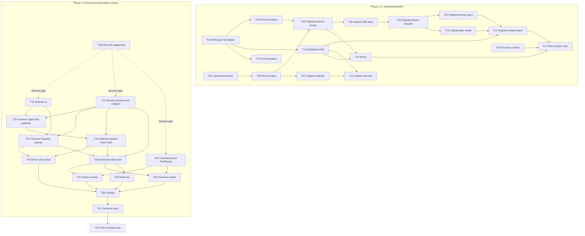

# Tickets

Implementation history, dependency seams, and current handoff for the
vulnerability dashboard. Canonical current behavior lives in
[RULES](../RULES.md), [CONTEXT](../CONTEXT.md),
[TECH_STACK](../TECH_STACK.md), [STRUCTURE](../STRUCTURE.md), and
[AGENTS](../../AGENTS.md).

[ADR-0001](../adr/0001-clickhouse-authoritative-query-engine.md) supersedes the
full-corpus browser query model. T05, T06, T08, T09, T10, and T12 remain as
historical records with explicit supersession notes. ADR history may therefore
use terminology that current guidance forbids.

## Status convention

Ticket acceptance checkboxes are preserved as historical criteria and are not
mass-checked from source inspection. The status below distinguishes:

- **Historical baseline:** implementation predates ADR-0001; surviving behavior
  remains, while named architecture has been superseded.
- **Implemented by source:** the T18-T31 code or documentation is present in the
  current tree. This does not certify runtime, performance, accessibility, or
  test acceptance criteria.
- **Pending:** implementation or verification is intentionally left to T32.

Current status:

- **T01-T17 — historical baseline.** Workspace, local infrastructure, initial
  data/browser slices, Sentry, test configuration, and first docs/structure
  pass exist. T05/T06/T08/T09/T10/T12 contain superseded behavior.
- **T18-T30 — implemented by source.** ADRs, schema v2, producer ingestion,
  gateway queries/SSE/export, shared contracts, UI primitives, dashboard
  rewrites, and cleanup are present. Deviations are annotated in the affected
  tickets.
- **T31 — implemented in this documentation change.** Canonical docs, ticket
  carryover, and stale rule references are aligned with observed code.
- **T32 — pending.** It owns focused tests and runtime evidence; no T31 prose
  marks those checks as passed.

## Dependency graph

## Index

### Foundation and first implementation

- [T01 Workspace foundation](T01-workspace-foundation.md)
- [T02 Local infrastructure](T02-local-infrastructure.md)
- [T03 Proto contract and Buf codegen](T03-proto-contract.md)
- [T04 Dataset ingest](T04-dataset-ingest.md)
- [T05 Producer gRPC streaming service](T05-producer-grpc-stream.md)
- [T06 Gateway SSE relay](T06-gateway-sse-relay.md)
- [T07 Gateway GraphQL layer](T07-gateway-graphql.md)
- [T08 Worker decoder and columnar index](T08-worker-decoder.md)
- [T09 Worker query engine](T09-worker-query-engine.md)
- [T10 Zustand store and Context boundaries](T10-state-stores.md)
- [T11 Dashboard shell and routing](T11-dashboard-shell.md)
- [T12 Virtualized grid](T12-virtualized-grid.md)
- [T13 Overview charts](T13-overview-charts.md)
- [T14 Sentry distributed tracing](T14-sentry-tracing.md)
- [T15 Test foundation](T15-test-foundation.md)
- [T16 Documentation rewrite](T16-docs-rewrite.md)
- [T17 Repository structure map](T17-structure-map.md)

### ClickHouse-authoritative refactor

- [T18 Architecture decision and documentation realignment](T18-architecture-decision.md)
- [T19 ClickHouse schema v2 and ingest mapping](T19-clickhouse-schema-v2.md)
- [T20 Producer ingestion and change publisher](T20-producer-ingest-publisher.md)
- [T21 Gateway GraphQL query layer](T21-gateway-graphql-queries.md)
- [T22 Gateway SSE change relay](T22-gateway-sse-change-relay.md)
- [T23 Shared contracts and GraphQL codegen](T23-shared-contracts-codegen.md)
- [T24 Server-side export workflow](T24-server-side-export.md)
- [T25 Dashboard data layer](T25-dashboard-data-layer.md)
- [T26 UI package primitives and TimeRange component](T26-ui-primitives-time-range.md)
- [T27 Explore rewrite](T27-explore-rewrite.md)
- [T28 Overview rewrite](T28-overview-rewrite.md)
- [T29 Detail view with live updates](T29-detail-live.md)
- [T30 Cleanup](T30-cleanup.md)
- [T31 Documentation rewrite for the shipped architecture](T31-docs-rewrite.md)
- [T32 Final risk-based QA](T32-final-qa.md)

## Phase seams

1. **Foundation (T01-T03).** Nx/Bun projects, local services, and protobuf
   generation established the initial boundaries.
2. **First data path (T04-T07).** The 236,656-row source corpus was ingested and
   the first GraphQL/SSE path was built. Its historical browser firehose was
   later superseded.
3. **First browser (T08-T13).** The shell, grid, state split, and overview were
   established. Browser decode/query ownership did not carry forward.
4. **Cross-cutting (T14-T17).** Sentry, test tooling, first canonical docs, and
   a structure map landed.
5. **ClickHouse-authoritative implementation (T18-T31).** The source tree now
   implements server-side ingestion, 236,653 current Findings from 236,656
   Source Records, bounded direct ClickHouse GraphQL queries, Redis Stream
   Dataset Event catch-up/coalescing, identity-encoded SSE, asynchronous local
   CSV export jobs, Apollo cursor pages, URL-backed exploration, live
   operational Zustand state, and rewritten UI surfaces.
6. **Final QA (T32).** Pending runtime and test evidence closes the refactor.

## Implemented deviations and carryover

- Finding identity includes `packageVersion`; omitting it would collapse 3,623
  additional source rows. Three exact identity duplicates still collapse, so
  `FINAL` returns 236,653 Findings.
- Gateway bounded result queries use `JSONCompactEachRow`.
- GraphQL responses may be compressed. SSE is intentionally identity-encoded
  because the middleware has no explicit event flush control.
- Every export uses one asynchronous in-process queue. `EXPORT_SYNC_ROW_LIMIT`
  remains a reserved configuration boundary and does not select a synchronous
  path.
- Export metadata expires in Redis, but local CSV files are not proactively
  removed at expiry. Download is refused once metadata expires.
- The dashboard polls `exportJob`; it does not currently resolve export
  readiness from the `export-ready` event.
- Zustand includes a bounded recent Finding-event list for detail/live
  presentation. Cross-tab `BroadcastChannel` synchronization was not shipped.
- Native `EventSource` resumes only during automatic reconnect of the current
  page instance. The stored `lastEventId` is operational display state, not
  reload-persistent replay state.
- Overview cards are grouped into focused modules rather than one source file
  per aggregate.
- Nx project tags classify applications and packages, but no current
  `enforce-module-boundaries` rule is configured. Import direction remains a
  documented review constraint.

## T32 handoff

T32 must add the selected Jest/RTL/Playwright coverage and collect runtime
evidence that documentation cannot establish:

- source-row and `FINAL` Finding counts, identity deduplication, date parsing,
  and relevant ClickHouse plans/latency;
- bounded pagination with no overlap/gap, cursor rejection, filter and exact
  `kaiStatus` semantics, facets, overview reconciliation, and detail;
- Redis replay, unavailable-cursor resync, coalescing, disconnect cleanup,
  SSE flush behavior through Vite, and GraphQL compression;
- ingest memory behavior, simulator on/off behavior, and bounded change limits;
- export row/order/header/formula safety, memory/cancellation behavior,
  expiry behavior, and the known local-artifact residue;
- Apollo cache merge/cap behavior, live/windowed updates, URL round trips,
  virtualized loading, keyboard/accessibility behavior, detail deletion, and
  Explore navigation;
- production bundle inspection, measured page/overview latency, and the
  critical Playwright journey with no browser protobuf or historical data
  traffic.

## Testing convention

T15 configured Jest, React Testing Library, and Playwright. T32 is the only
Phase 5 ticket intended to add broad test coverage. Small pre-existing tests
remain historical; T31 adds no tests and does not run the test suite.
