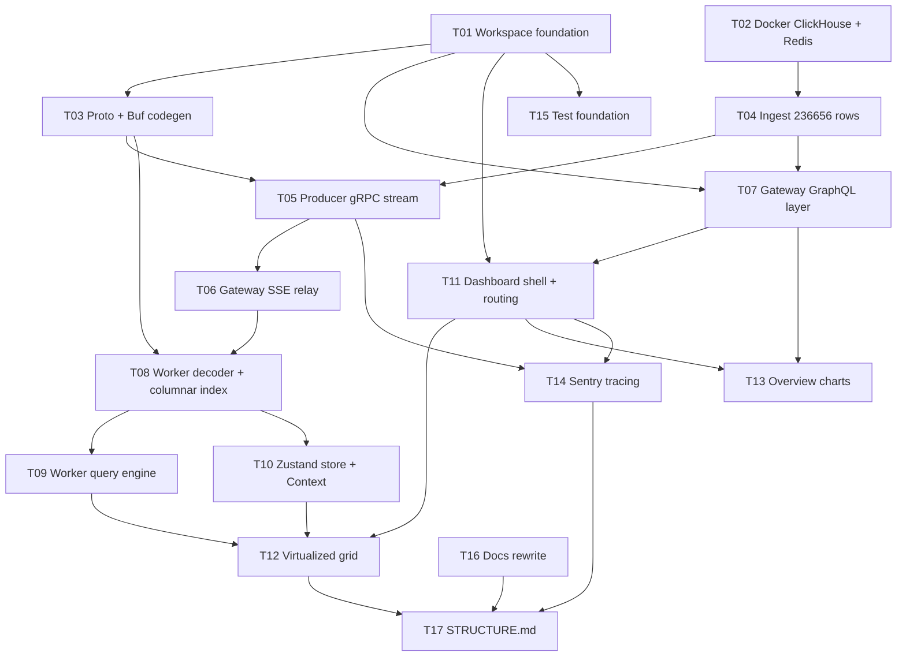

# Tickets

Implementation tickets for the gRPC-to-SSE vulnerability dashboard. Each ticket
is an independently reviewable slice with explicit blocking edges.

Authoritative context lives in [RULES.md](../RULES.md), [CONTEXT.md](../CONTEXT.md),
[TECH_STACK.md](../TECH_STACK.md), and [AGENTS.md](../../AGENTS.md). Those docs
must agree with this ticket set (T16). If a conflict remains, this ticket set
wins until the docs are corrected again.

## Dependency graph

## Index

- [T01 Workspace foundation](T01-workspace-foundation.md)
- [T02 Local infrastructure](T02-local-infrastructure.md)
- [T03 Proto contract and Buf codegen](T03-proto-contract.md)
- [T04 Dataset ingest](T04-dataset-ingest.md)
- [T05 Producer gRPC streaming service](T05-producer-grpc-stream.md)
- [T06 Gateway SSE relay](T06-gateway-sse-relay.md)
- [T07 Gateway GraphQL layer](T07-gateway-graphql.md)
- [T08 Worker decoder and columnar index](T08-worker-decoder.md)
- [T09 Worker query engine](T09-worker-query-engine.md)
- [T10 Zustand store and Context boundaries](T10-state-stores.md)
- [T11 Dashboard shell and routing](T11-dashboard-shell.md)
- [T12 Virtualized grid](T12-virtualized-grid.md)
- [T13 Overview charts](T13-overview-charts.md)
- [T14 Sentry distributed tracing](T14-sentry-tracing.md)
- [T15 Test foundation](T15-test-foundation.md)
- [T16 Documentation rewrite](T16-docs-rewrite.md)
- [T17 Repository structure map](T17-structure-map.md)

## Parallelism

T01, T02, and T16 have no blockers and may start simultaneously. T16 is the
strongest subagent candidate: large prose output, no coupling to code.

## Phase seams

Natural stopping points, each ending in something verifiable:

1. **Foundation** (T01-T03): typecheck passes, containers healthy, gRPC round trip succeeds.
2. **Data path** (T04-T07): ClickHouse holds 236,656 rows and `curl` against the SSE endpoint emits base64 frames.
3. **Browser** (T08-T13): the grid scrolls the full result set without dropping frames.
4. **Cross-cutting** (T14-T17): tracing, test scaffolding, and documentation.

## Conventions

No test files are written in any ticket. T15 establishes the test foundation
only; specs are deliberately deferred.
